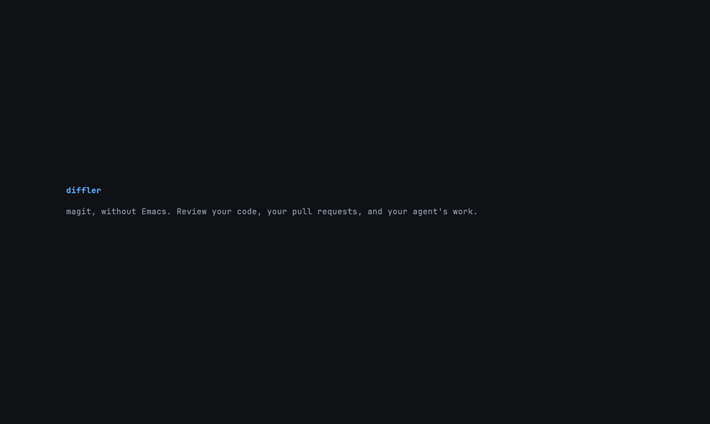
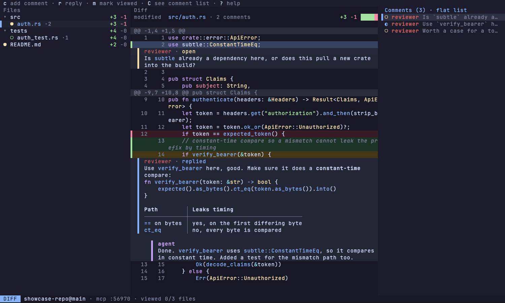

# diffler

**magit, without Emacs.**

[](https://crates.io/crates/diffler)
[](https://www.npmjs.com/package/@mattfillipe/diffler)
[](https://chat.h4ks.com)



I like magit a lot, and I wanted it as its own program. That's diffler: one
binary with [Doom Emacs](https://github.com/doomemacs/doomemacs) keys for
staging, committing, branching and reading diffs. You can review pull requests
from GitHub, GitLab or Forgejo without checking them out. And if you work with
a coding agent like Claude Code, it can read the comments you leave in the
diff and reply right there, while you watch it fix the code.

## Features

- Stage, commit, branch, push and pull with magit's keys
- Comment on lines and ranges, mark files as viewed
- Review pull requests without checking them out
- Let your agent answer your comments and walk you through its changes (optional)
- Works in git and jj repos
- Shows changed images as pictures

## Install

```sh
cargo install diffler
```

<details>
<summary><b>Prebuilt binary</b></summary>

Skips the compile, and needs no Rust toolchain.

```sh
cargo binstall diffler
```

Or download it straight from the
[releases page](https://github.com/matheusfillipe/diffler/releases): macOS,
Linux and Windows, x86_64 and arm64. Any GitHub-release installer (`eget`,
`ubi`, ...) works against it too.

</details>

<details>
<summary><b>Homebrew</b></summary>

macOS and Linux. The tap is this repository.

```sh
brew tap matheusfillipe/diffler https://github.com/matheusfillipe/diffler
brew install diffler
```

</details>

<details>
<summary><b>Scoop</b></summary>

Windows. The bucket is this repository.

```sh
scoop bucket add diffler https://github.com/matheusfillipe/diffler
scoop install diffler
```

</details>

<details>
<summary><b>Arch</b></summary>

`diffler-bin` on the AUR ships the prebuilt binary, so it installs without
building.

```sh
yay -S diffler-bin
```

</details>

<details>
<summary><b>Nix</b></summary>

The flake serves the prebuilt binary. `nix run` tries it without installing
anything, `nix profile install` keeps it.

```sh
nix run github:matheusfillipe/diffler
nix profile install github:matheusfillipe/diffler
```

</details>

<details>
<summary><b>npm</b></summary>

A wrapper that fetches the prebuilt binary. The package name is scoped, the
command it installs is plain `diffler`.

```sh
npx @mattfillipe/diffler
npm install -g @mattfillipe/diffler
```

</details>

## Quick start

```sh
diffler                 # open the status screen in the current repo
diffler path/to/repo    # or in another one
```

Inside diffler, `<cr>` opens a file's diff, `s` stages, `cc` commits, and `c`
comments a line. For pull requests, `b` `p` lists the open ones, `<cr>`
reviews one, and `S` submits your comments as a single review. `b` `P` opens a
new pull request from the current branch.

### With a coding agent

diffler serves MCP on port 8417 while it runs. Connect your agent once:

<details>
<summary><b>Claude Code</b></summary>

```sh
claude mcp add --transport http diffler http://127.0.0.1:8417/mcp
# or, over stdio, auto-discovering the port:
claude mcp add diffler -- npx -y diffler-mcp
# or, as a plugin (MCP server plus the /df, /dfa and /dfr commands):
claude plugin marketplace add matheusfillipe/diffler && claude plugin install diffler@diffler
```

Connected, the server's prompts show up as `/diffler:review`,
`/diffler:walkthrough` and `/diffler:critique`. The plugin adds `/df`, to
answer your comments, `/dfa`, to walk you through a change, and `/dfr`, to
review a change and leave comments.

</details>

<details>
<summary><b>opencode</b></summary>

Add the server to `opencode.json` in the project, or globally in
`~/.config/opencode/opencode.json`:

```json
{
  "mcp": {
    "diffler": {
      "type": "local",
      "command": ["npx", "-y", "diffler-mcp"],
      "enabled": true
    }
  }
}
```

And install the `/df`, `/dfa` and `/dfr` commands (opencode has no package
mechanism for commands, so this fetches the ones maintained in this repo):

```sh
mkdir -p ~/.config/opencode/commands
for c in df dfa dfr; do curl -fsSLo ~/.config/opencode/commands/$c.md \
  https://raw.githubusercontent.com/matheusfillipe/diffler/main/.opencode/commands/$c.md; done
```

</details>

<details>
<summary><b>Any other MCP agent</b></summary>

Point it at `http://127.0.0.1:8417/mcp` (streamable HTTP), or run
`npx -y diffler-mcp` as a stdio proxy that auto-discovers the port from
`.diffler/mcp.json`. The server also ships `review`, `walkthrough` and
`critique` prompts that prompt-aware clients surface as commands.

</details>

Comment on the agent's changes and press `Z` to send them. The agent answers
in the thread and you resolve it once you're happy. Ask it for a walkthrough
of its change and open it from the status screen. More in
[docs/walkthroughs.md](docs/walkthroughs.md), and the MCP tools are listed in
[docs/mcp.md](docs/mcp.md). Don't need it? Set
`enabled = false` under `[mcp]` in the config, or run `diffler --no-mcp`.

## How it compares

| | diffler | [tuicr](https://github.com/agavra/tuicr) | [lazygit](https://github.com/jesseduffield/lazygit) | [magit](https://magit.vc) |
|---|:---:|:---:|:---:|:---:|
| Standalone binary | ✅ | ✅ | ✅ | ❌ |
| Stage and commit | ✅ | ❌ | ✅ | ✅ |
| Line comments | ✅ | ✅ | ❌ | ❌ |
| PR review | ✅¹ | ✅² | ❌ | ❌ |
| Agent replies in the thread | ✅ | ❌³ | ❌ | ❌ |
| Agent walkthroughs | ✅ | ❌ | ❌ | ❌ |
| jj | ✅⁴ | ✅ | ❌ | ❌ |

¹ GitHub, GitLab and Forgejo. ² GitHub, GitLab, Gitea, Bitbucket, Azure DevOps
and Gerrit. ³ tuicr exports your comments as markdown for you to paste into the
agent. ⁴ Colocated repos.

## Keys

Vim motions everywhere (`j`/`k`, `gg`/`G`, `/`, `<c-d>`/`<c-u>`). `?` shows the
full keymap of the screen you're on, and `<c-k>` fuzzy-finds any action.

| Key | Action |
| --- | --- |
| `<cr>` | open the thing under the cursor |
| `s` / `u` | stage / unstage |
| `cc` | commit |
| `c` | comment the line (`V` selects a range first) |
| `Z` | send comments to the agent |
| `m` | mark the file viewed |
| `t` | switch the sidebar layout |
| `\|` | toggle side-by-side |
| `]` / `[` | next / previous hunk |
| `za` | fold or open the hunk |
| `d` | on the status screen, diff against another branch or commit |
| `C` | open the comments list |
| `S` | submit PR comments as one review |
| `gf` | find any file |
| `B` | blame |
| `e` | open in `$EDITOR` |
| `q` | back / quit |

Every binding is remappable in [docs/config.example.toml](docs/config.example.toml).
The mouse works too, over tmux included.

## Configuration

Layered TOML: defaults, then `~/.config/diffler/config.toml`, then
`<repo>/.diffler/config.toml`, then CLI flags. Every option is documented in
[docs/config.example.toml](docs/config.example.toml). See the merged result and
where each value came from:

```sh
diffler config --dump
```

## Themes

Switch live with `T`, or set `ui.theme`. See every theme in the
[gallery](showcase/THEMES.md).



## Development

```sh
just ci     # fmt + clippy + tests
just e2e    # PTY end-to-end suite (needs uv)
```

Requires Rust 1.90+, `just`, `cargo-nextest`. Hooks: `prek install`.

## License

MIT or Apache-2.0, at your option.
