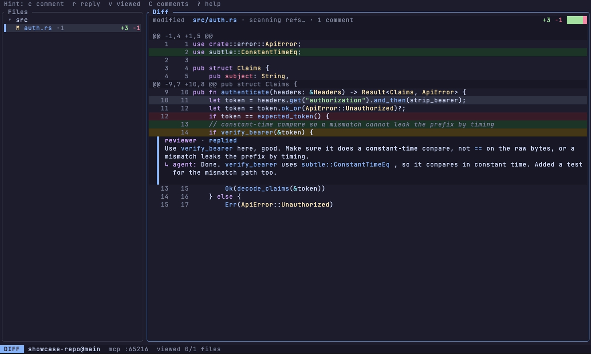
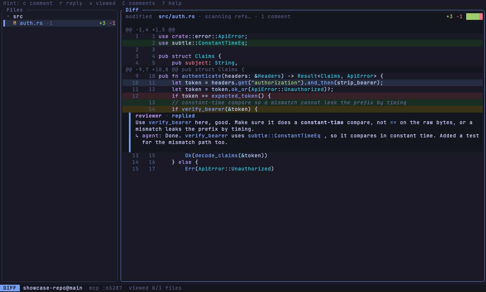
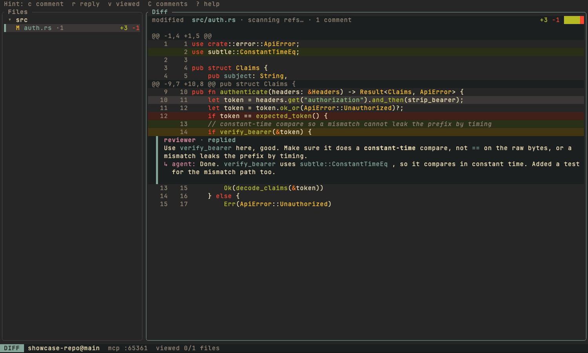
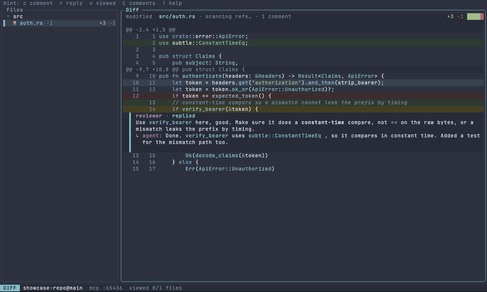
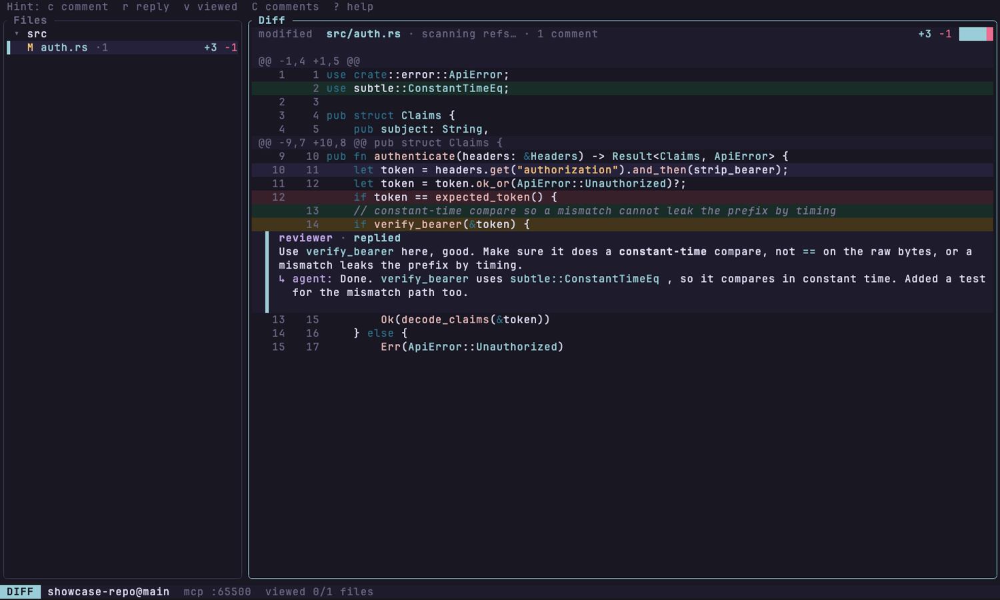
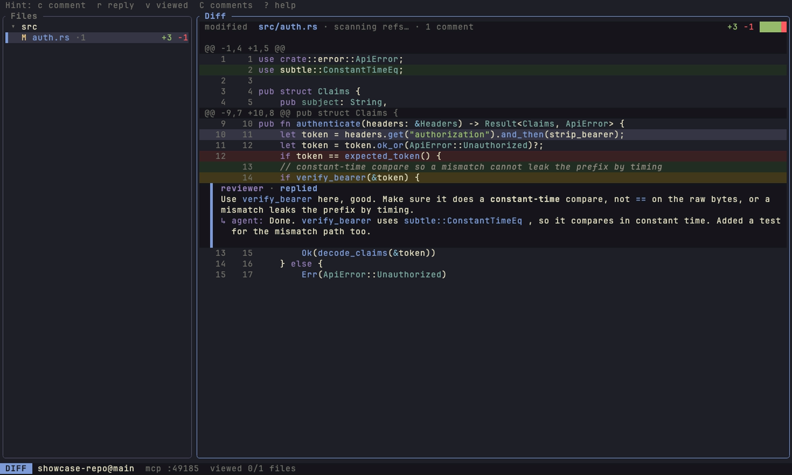
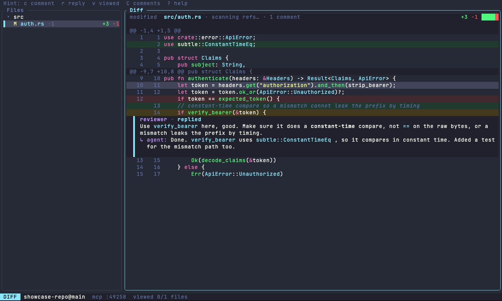
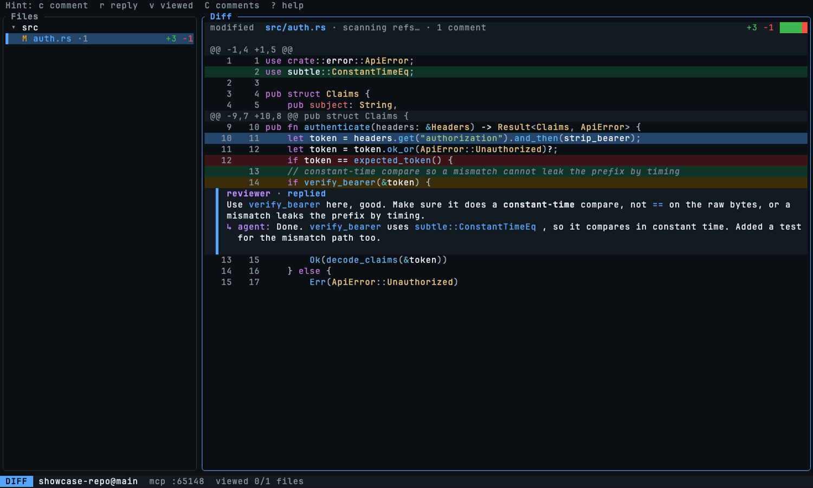
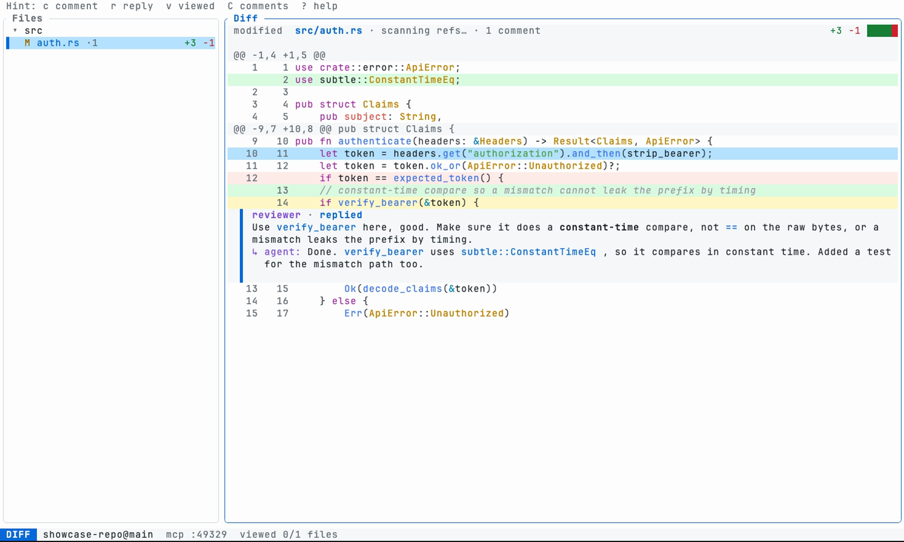

# Themes

Switch live with `T` (or the `<c-k>` palette). To set a default, pass
`diffler --theme <name>` or add to config:

```toml
[ui]
theme = "catppuccin-mocha"
```

## catppuccin-mocha


## tokyo-night


## gruvbox-dark


## nord


## rose-pine


## kanagawa


## dracula


## github-dark


## github-light


Regenerate these with `showcase/record.sh` (needs `vhs`).
